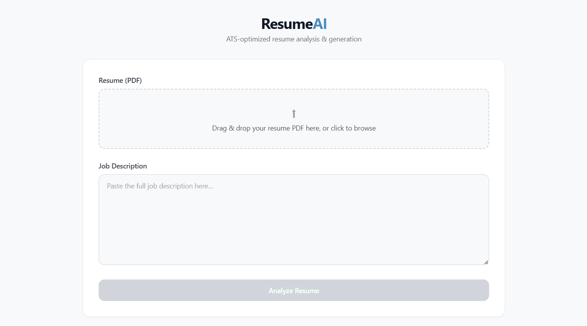

# ResumeAI

ATS resume analyzer — upload a resume PDF and job description, get a match score with skill gap analysis, and download a tailored resume with missing skills injected.



## Project Structure

```text
ResumeAI/
├── backend/
│   ├── api/main.py                 ← FastAPI (2 endpoints)
│   ├── person1_parsing/            ← PDF + JD parsing (PyMuPDF, regex)
│   ├── person2_scoring/            ← TF-IDF + semantic scoring (sentence-transformers)
│   ├── person3_generation/         ← Resume assembly + PDF generation (reportlab/LaTeX)
│   ├── data/                       ← Sample resumes + JDs
│   ├── pipeline.py                 ← CLI pipeline wiring stages 1→2→3
│   ├── generate_resume.py          ← CLI with --add-missing-skills flag
│   ├── requirements.txt            ← Python deps (pipeline)
│   └── requirements-api.txt        ← Python deps (FastAPI layer)
├── frontend/
│   ├── app/page.tsx                ← Single-page app (upload → results → download)
│   ├── components/ScoreRing.tsx    ← SVG radial gauge
│   ├── components/SkillChips.tsx   ← Color-coded skill chips
│   ├── next.config.mjs             ← Proxies /api/* → FastAPI :8000
│   └── package.json                ← Next.js 14 + Tailwind
└── .gitignore
```

## Pipeline

```text
Resume PDF + JD text
  → Stage 1: parse_resume() + parse_jd()
  → Stage 2: score_resume() — TF-IDF + semantic (all-MiniLM-L6-v2) + gap analysis
  → Stage 3: assemble_resume() → inject_missing_skills() → generate_resume_pdf()
  → Tailored PDF + score dashboard
```

## Quick Start

### Prerequisites

- Python 3.10+
- Node.js 18+

### 1. Backend

```bash
cd backend
pip install -r requirements.txt
pip install -r requirements-api.txt
python -m uvicorn api.main:app --reload --port 8000
```

First run downloads the sentence-transformers model (~80 MB, one-time).

### 2. Frontend

```bash
cd frontend
npm install
npm run dev
```

### 3. Use

Open **http://localhost:3000** → upload PDF → paste JD → click **Analyze Resume** → view scores → **Download Tailored Resume**.

First analysis takes ~15-30s (model loading). Subsequent runs take ~5-10s.

## API Endpoints

| Method | Path                     | Description                               |
| ------ | ------------------------ | ----------------------------------------- |
| `POST` | `/api/analyze`           | Upload resume PDF + JD text → scores JSON |
| `GET`  | `/api/download/{job_id}` | Download generated tailored PDF           |
| `GET`  | `/api/health`            | Health check                              |

Swagger docs available at **http://localhost:8000/docs**.

## Testing

```bash
# Option 1: Python smoke test
cd ResumeAI/backend
python test_api.py

# Option 2: curl
curl -X POST http://localhost:8000/api/analyze \
  -F "resume=@data/sample_resumes/milan.pdf" \
  -F "jd_text=Software Engineer. Requirements: Python, React, Node.js, SQL."

# Option 3: Swagger UI
 http://localhost:8000/docs
```

## Tech Stack

| Layer      | Stack                                                         |
| ---------- | ------------------------------------------------------------- |
| Parsing    | PyMuPDF, regex, spaCy                                         |
| Scoring    | sentence-transformers (all-MiniLM-L6-v2), scikit-learn TF-IDF |
| Generation | reportlab (fallback) / pdflatex + Jinja2                      |
| API        | FastAPI, uvicorn                                              |
| Frontend   | Next.js 14, React 18, Tailwind CSS, TypeScript                |
